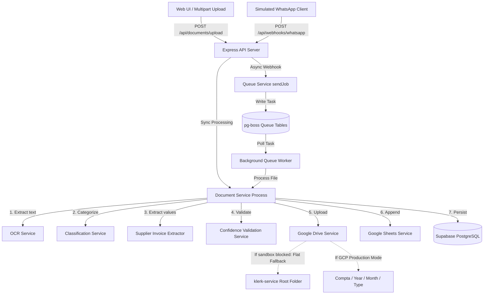
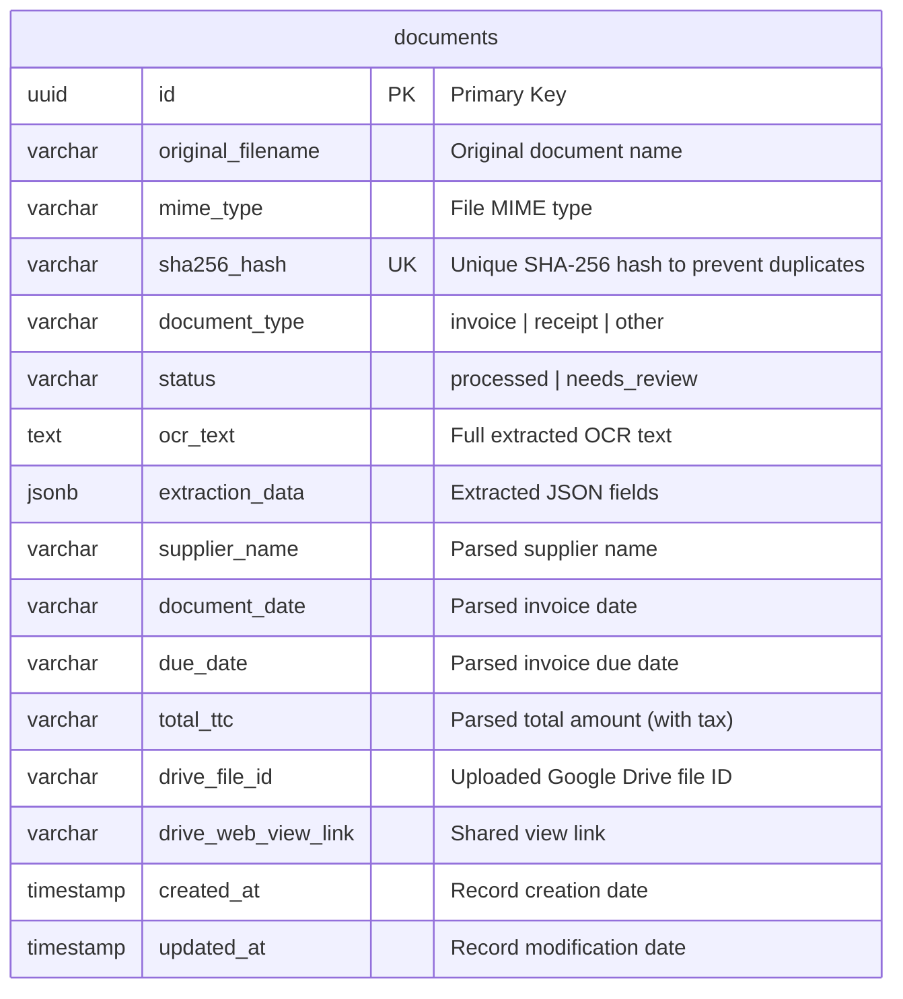

# Klerk AI Document Processing MVP

Klerk is a premium, developer-ready AI-powered document processing assistant that automates invoice, receipt, and document parsing. It extracts key structural data (dates, totals, suppliers), uploads files to Google Drive, appends transaction rows to Google Sheets, and updates a local Supabase PostgreSQL registry in the background.

---

## 🏗️ System Architecture

The following Mermaid diagram visualizes the asynchronous ingestion, queuing, and synchronization process:



---

## 📑 Database Schema

The metadata registry is stored in a `documents` database table in Supabase.

### Entity Relationship Diagram (ERD)



---

## 🔌 API Endpoints Spec

### 1. Document Upload (Synchronous)
* **Endpoint**: `POST /api/documents/upload`
* **Content-Type**: `multipart/form-data`
* **Payload**: File attachment field `file`.
* **Response (`200 OK`)**:
  ```json
  {
    "documentId": "uuid-here",
    "filename": "invoice_example.pdf",
    "documentType": "invoice",
    "status": "processed",
    "extraction": {
      "supplier_name": { "value": "Example Supplier", "confidence": 0.9 },
      "document_date": { "value": "12/06/2026", "confidence": 0.95 },
      "total_ttc": { "value": "1246.80", "confidence": 0.85 }
    },
    "duplicateDetected": false
  }
  ```

### 2. WhatsApp Ingestion Webhook (Asynchronous)
* **Endpoint**: `POST /api/webhooks/whatsapp`
* **Content-Type**: `application/json`
* **Payload**:
  ```json
  {
    "from": "+33612345678",
    "mediaUrl": "https://example.com/invoice.pdf",
    "mediaName": "invoice.pdf"
  }
  ```
* **Response (`202 Accepted`)**:
  ```json
  {
    "status": "accepted",
    "jobId": "job-uuid",
    "message": "Document enqueued for processing"
  }
  ```

### 3. Check Job Status
* **Endpoint**: `GET /api/jobs/:id`
* **Response (`200 OK`)**:
  ```json
  {
    "jobId": "job-uuid",
    "state": "completed" // created | active | completed | failed
  }
  ```

---

## 🛠️ Getting Started

### Prerequisites
* **Node.js** (v18 or v20)
* **npm** (v9+)
* A running **Supabase** instance (PostgreSQL)

### Installation
1. Clone this repository.
2. Copy `.env.example` to `.env` and fill in the required values.
3. Install dependencies:
   ```bash
   npm install
   ```

### Mode Toggles
In `.env`, you can toggle services between Mock and Real mode:
* **Google Integration Mock**: Set to `true` to use simulated local folder creation and logs, or `false` to connect to your real Google Drive & Sheets using OAuth 2.0.
* **OCR fallback**: Extractor automatically provides structured fallback regex parser logic if no external OCR is bound.

---

## 🚀 Running the App

### Development Mode (Express API + pg-boss Worker)
```bash
npm run dev
```

### Production Build
```bash
npm run build
npm start
```

### Running with Docker & Compose
We provide containerized setup profiles to run the application instantly:
```bash
# Build and run the app service
docker-compose up --build
```

---

## 🧪 Testing and Verification

We provide three comprehensive testing suites to verify processing and extraction accuracy:

### 1. French Extraction Regex Regression Tests
Matches realistic French billing label layouts, messy spacing boundaries, and decimal formatting:
```bash
npm run test:regression
```

### 2. Google OAuth Drive & Sheets Integration Tests
Verifies real connection linkages, fallback flat folder creation, and sheet transaction row logs:
```bash
# Verify Google connection (ensure GOOGLE_DRIVE_MOCK=false)
npx ts-node tests/GoogleIntegration.test.ts
```

### 3. WhatsApp Queue Ingestion Integration Tests
Starts the Express server, fires a WhatsApp message webhook, enqueues the job into `pg-boss`, processes it in the background worker, and asserts database persistence:
```bash
# Run background workers and webhook tests end-to-end
npx ts-node tests/QueueSimulation.test.ts
```
