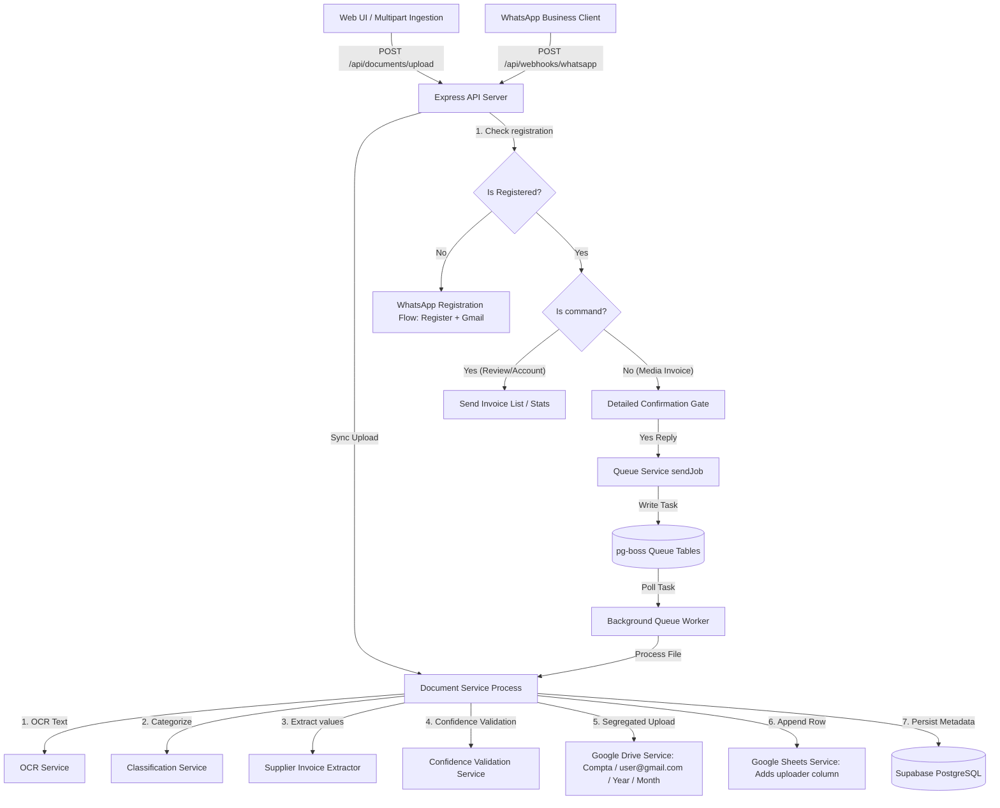
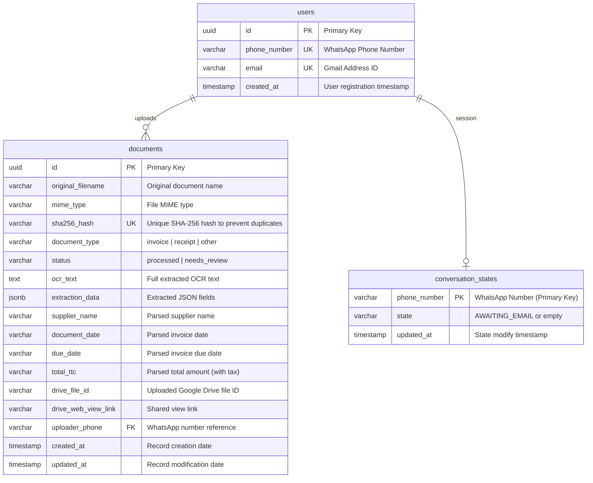

# Klerk AI Multi-Tenant Document Processing MVP

Klerk is a premium, developer-ready AI-powered document processing assistant that automates invoice, receipt, and document parsing. It features multi-tenancy, WhatsApp conversational registration, user-level file segregation, double-confirmation safety gates, and background task queues.

---

## 🏗️ System Architecture

The following Mermaid diagram visualizes the asynchronous ingestion, registration state machine, queuing, and synchronization process:



---

## 📑 Database Schema

Klerk is built with a multi-tenant relational schema mapping WhatsApp users to their unique files.

### Entity Relationship Diagram (ERD)



---

## 📱 Conversational Features

Klerk transforms your WhatsApp channel into a rich accounting console:

### 1. WhatsApp User Registration
If an unregistered number messages the bot, all uploads are blocked. They must register first:
* User sends `"Hi"` ➔ Bot prompts: *"Please reply Register to start registration"*
* User sends `"Register"` ➔ Bot prompts: *"Please reply with your Gmail address"*
* User sends `"yourname@gmail.com"` ➔ Bot registers the account, clears states, and opens uploads.

### 2. Double-Confirmation Safety Gate
When a registered user sends an invoice:
1. **Structured Details Preview**: The bot runs instant OCR & LLM extraction and texts back a clean breakdown card:
   > 📄 **New Document Detected**
   > * **File**: `invoice_xyz.pdf`
   > * **Type**: `INVOICE`
   > * **Supplier**: `Moreau Plomberie`
   > * **Total**: `124.00 €`
   > * *Reply **Yes** to log, **No** to discard*
2. **State Confirmation**:
   * `"Yes"`: Commits document, uploads it to Drive, appends to Sheets, logs database, and texts back confirmation.
   * `"No"`: Cancels the upload and deletes temp files.

### 3. Assistant Commands
* **`Review`** (or **`r`**): Returns a list of the user's last 5 processed invoices, complete with clickable Google Drive links.
* **`Account`** (or **`a`**): Returns the active profile status including their registered Gmail address and total invoices logged.
* **`Hi`** / **`Menu`**: Displays the active commands menu helper.

---

## 🔌 API Endpoints Spec

### 1. Document Upload (Synchronous)
* **Endpoint**: `POST /api/documents/upload`
* **Content-Type**: `multipart/form-data`
* **Payload**: File attachment field `file`.
* **Response (`200 OK`)**:
  ```json
  {
    "documentId": "uuid-here",
    "filename": "invoice_example.pdf",
    "documentType": "invoice",
    "status": "processed",
    "extraction": {
      "supplier_name": { "value": "Example Supplier", "confidence": 0.9 },
      "document_date": { "value": "12/06/2026", "confidence": 0.95 },
      "total_ttc": { "value": "1246.80", "confidence": 0.85 }
    },
    "duplicateDetected": false
  }
  ```

### 2. WhatsApp Ingestion Webhook (Asynchronous)
* **Endpoint**: `POST /api/webhooks/whatsapp`
* **Content-Type**: `application/json`
* **Payload**:
  ```json
  {
    "from": "+33612345678",
    "mediaUrl": "https://example.com/invoice.pdf",
    "mediaName": "invoice.pdf"
  }
  ```
* **Response (`202 Accepted`)**:
  ```json
  {
    "status": "accepted",
    "jobId": "job-uuid",
    "message": "Document enqueued for processing"
  }
  ```

### 3. Check Job Status
* **Endpoint**: `GET /api/jobs/:id`
* **Response (`200 OK`)**:
  ```json
  {
    "jobId": "job-uuid",
    "state": "completed" // created | active | completed | failed
  }
  ```

---

## 📂 Repository File Layout

Here are the key implementation files in this repository:
* 🛠️ **Task Queue**: [project/src/queue/QueueService.ts](project/src/queue/QueueService.ts) manages background job dispatching via `pg-boss`.
* ⚡ **Express Server**: [project/src/api/server.ts](project/src/api/server.ts) exposes webhook ingestion, registration, and commands handlers.
* 👤 **User Management**: [project/src/repositories/UserRepository.ts](project/src/repositories/UserRepository.ts) handles DB session states and profiles.
* 📑 **Extraction Logic**: [project/src/services/SupplierInvoiceExtractor.ts](project/src/services/SupplierInvoiceExtractor.ts) handles natural data parsing.
* 🔗 **Google Integration**: [project/src/services/GoogleDriveService.ts](project/src/services/GoogleDriveService.ts) segregates files into user folders with self-healing fallback names.

---

## 🛠️ Getting Started

### Prerequisites
* **Node.js** (v18 or v20)
* **npm** (v9+)
* A running **Supabase** instance (PostgreSQL)

### Installation
1. Clone this repository.
2. Navigate to the project folder:
   ```bash
   cd project
   ```
3. Copy `.env.example` to `.env` and fill in the required values.
4. Install dependencies:
   ```bash
   npm install
   ```

### Mode Toggles
In `.env`, you can toggle services between Mock and Real mode:
* **Google Integration Mock**: Set to `true` to use simulated local folder creation and logs, or `false` to connect to your real Google Drive & Sheets using OAuth 2.0.
* **OCR fallback**: Extractor automatically provides structured fallback regex parser logic if no external OCR is bound.

---

## 🚀 Running the App

The project is structured as a monorepo split:
* **Backend API & background worker (`/project`)**: Listens on Port `3001`.
* **Frontend React Dashboard (`/frontend`)**: Listens on Port `5173`.

### 1. Running Locally (Development Mode)

**Terminal 1 — Backend**:
```bash
cd project
npm run dev
```

**Terminal 2 — Frontend**:
```bash
cd frontend
npm run dev
```
Navigate to `http://localhost:5173` in your browser to access the premium Drag-and-Drop dashboard!

### 2. Containerized Docker Run
We provide a containerized setup to launch the application:
```bash
cd project
docker-compose up --build
```

---

## ☁️ Cloud Deployment & WhatsApp Setup

We provide production configurations and guides in the root documentation folders:
* **[Production Cloud Deployment Guide](file:///c:/Users/lenovo/Desktop/free_lancing/klerk/documentation/deployment/production_deployment.md)**: Deployment steps for Render and Railway.
* **[WhatsApp API Token Setup Guide](file:///c:/Users/lenovo/Desktop/free_lancing/klerk/documentation/usage_guide/whatsapp_tokens_setup.md)**: Setup guide for custom verification and access tokens.

---

## 🧪 Testing and Verification

We provide three comprehensive testing suites to verify processing and extraction accuracy:

### 1. French Extraction Regex Regression Tests
Matches French billing layouts and spacing boundaries:
```bash
cd project
npm run test:regression
```

### 2. Google OAuth Drive & Sheets Integration Tests
Verifies Google connection, folder nesting creation, and spreadsheet transaction logs:
```bash
cd project
npx ts-node tests/GoogleIntegration.test.ts
```

### 3. WhatsApp Queue Ingestion Integration Tests
Starts the server, fires a webhook, enqueues the job into `pg-boss`, processes it, and asserts database persistence:
```bash
cd project
npx ts-node tests/QueueSimulation.test.ts
```
